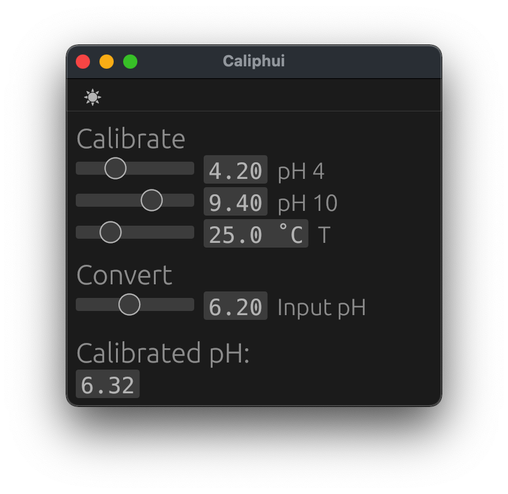
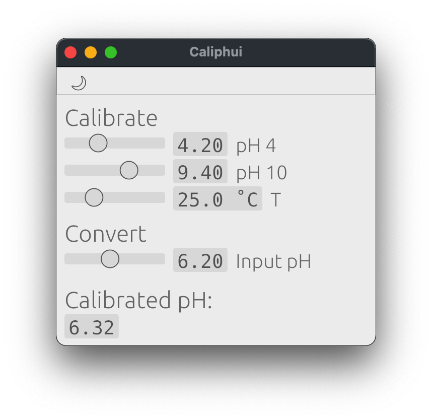

# caliphui

[](https://opensource.org/licenses/MPL-2.0)
[](https://creativecommons.org/licenses/by-sa/4.0/)
[](https://github.com/pdunne/caliphui/actions/workflows/rust.yml)

A simple GUI version of the pH calibration tool written in [egui](https://github.com/emilk/egui), based on the [eframe](https://github.com/emilk/egui/tree/master/eframe) template.

<figure>
  
  
  <figcaption>Dark mode and light mode GUI</figcaption>
</figure>

## Usage

- Native binaries are provided under [releases](https://github.com/pdunne/caliphui/releases)
- A web interface [here](https://pdunne.github.io/caliphui/)
- Cloning the repo and running locally (see below)

### Testing locally

```console
git clone https://github.com/pdunne/caliphui.git
cd caliphui
cargo run --release
```

On Linux you might need to first run:

```console
sudo apt-get install libxcb-render0-dev libxcb-shape0-dev libxcb-xfixes0-dev libspeechd-dev libxkbcommon-dev libssl-dev
```

On Fedora Rawhide you might need to run:

```console
dnf install clang clang-devel clang-tools-extra speech-dispatcher-devel libxkbcommon-devel pkg-config openssl-devel
```

### Compiling for the web

The eframe template provides three scripts to prepare and compile the web version. For details see the [template](https://github.com/emilk/egui/tree/master/eframe).
